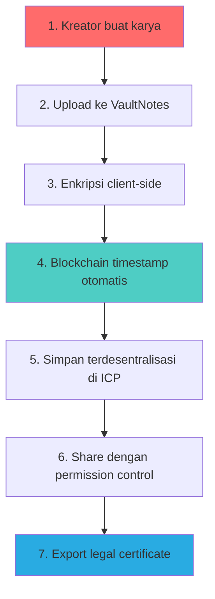
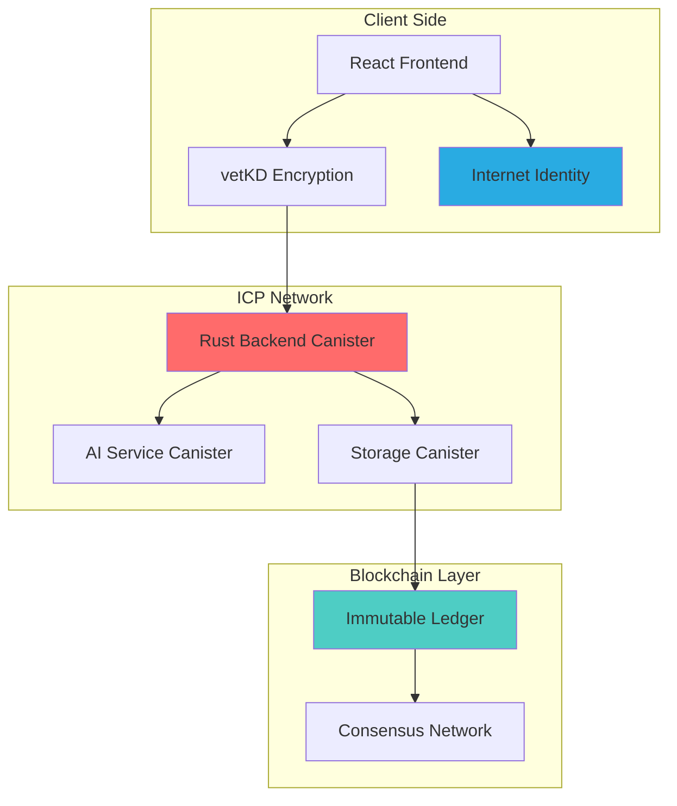

# 🔐 VaultNotes - Proof of Creation for Indonesia's Creative Economy

<div align="center">
  
  
  
  
  
  <h2>🎨 Protect Your Creative Work with Blockchain-Powered IP Rights</h2>
  <p><strong>Your Creative Work • Your Proof • Your Rights</strong></p>
  
  <p>
    <a href="#-problem">Problem</a> •
    <a href="#-solution">Solution</a> •
    <a href="#-features">Features</a> •
    <a href="#-demo">Demo</a> •
    <a href="#-tech-stack">Tech Stack</a> •
    <a href="#-roadmap">Roadmap</a>
  </p>
  
</div>

---

## 🎯 Hackathon Submission

**Event:** Infinity Hackathon OJK-Ekraf 2025  
**Sub-Tema:** Digital Rights & Authentication  
**Focus:** Verifikasi hak cipta dan penentuan kepemilikan digital karya kreatif  
**Deadline:** 22 Oktober 2025  

---

## 📋 Table of Contents

- [Problem Statement](#-problem-statement)
- [Our Solution](#-our-solution)
- [Key Features](#-key-features)
- [Use Cases](#-use-cases)
- [How It Works](#-how-it-works)
- [Technical Architecture](#-technical-architecture)
- [Security & Compliance](#-security--compliance)
- [Demo](#-demo)
- [Quick Start](#-quick-start)
- [Roadmap](#-roadmap)
- [Business Model](#-business-model)
- [Team](#-team)
- [Contributing](#-contributing)
- [License](#-license)

---

## 🔴 Problem Statement

### Kreator Indonesia Kehilangan Hak atas Karya Mereka

Indonesia memiliki **20+ juta pekerja kreatif** yang berkontribusi **Rp 1.2 Triliun** terhadap GDP. Namun, mereka menghadapi tantangan kritis:

| Problem | Impact |
|---------|--------|
| **📊 Plagiarisme Merajalela** | 70%+ kreator pernah karyanya dicuri |
| **💸 Kehilangan Ekonomi** | Triliunan rupiah potensi hilang karena IP theft |
| **⚖️ Tanpa Bukti Legal** | Sulit membuktikan kepemilikan di pengadilan |
| **🔒 Platform Terpusat** | Perusahaan mengontrol data & hak cipta |
| **👥 Konflik Kolaborasi** | Tidak ada transparansi siapa kontribusi apa |

### Real Stories

> *"Saya membuat desain untuk klien, tapi mereka klaim itu ide mereka sendiri. Saya tidak punya bukti bahwa saya yang buat duluan."*  
> — **Desainer Freelance, Jakarta**

> *"Draft novel saya bocor sebelum publikasi. Sekarang ada yang claim mereka penulisnya."*  
> — **Penulis Indie, Bandung**

### Why Current Solutions Failed?

- **Google Drive / Dropbox:** Data di server terpusat, perusahaan bisa akses/hapus, bukan bukti legal
- **Email ke Diri Sendiri:** Mudah dimanipulasi timestamp, tidak diterima pengadilan
- **Notaris Offline:** Mahal (Rp 500K+), lambat (berhari-hari), perlu datang fisik
- **Blockchain Existing:** Fokus ke NFT/speculation, bukan IP protection untuk draft
- **GitHub:** Tidak terenkripsi, harus public untuk timestamp proof

---

## ✨ Our Solution

### VaultNotes: Decentralized Platform for Creative IP Protection

**VaultNotes** memberikan **bukti kepemilikan legal** untuk karya digital kreator Indonesia menggunakan teknologi blockchain Internet Computer Protocol (ICP).

#### Core Value Propositions

🔐 **Proof of Authorship**  
Setiap karya timestamped immutably di blockchain — bukti legal "Saya buat ini di tanggal X jam Y"

🤝 **Transparent Collaboration**  
Audit trail transparan siapa kontribusi apa dalam proyek kolaboratif

🛡️ **Military-Grade Security**  
vetKD threshold cryptography — enkripsi end-to-end tanpa single point of failure

🌐 **True Ownership**  
Decentralized storage — data Anda bukan di server perusahaan, tapi on-chain selamanya

⚖️ **Legal-Ready**  
Blockchain evidence yang diterima di pengadilan sesuai UU Hak Cipta No. 28/2014

---

## 🌟 Key Features

### Production-Ready Features ✅

| Feature | Description | Benefit |
|---------|-------------|---------|
| **🔐 Blockchain Timestamping** | Setiap karya dicap waktu immutable di ICP | Bukti legal kepemilikan |
| **🔒 End-to-End Encryption** | vetKD threshold cryptography | Hanya Anda yang bisa baca konten |
| **🤝 Smart Sharing** | Permission control (read/edit) + audit trail | Kolaborasi aman & transparan |
| **🤖 AI Content Fingerprinting** | Deteksi similarity untuk anti-plagiarisme | Cegah pencurian karya |
| **📊 AI Summarization** | On-chain content summarization | Quick reference & organization |
| **⚡ Smart Caching** | Intelligent result caching | 10x faster performance |
| **🔑 Internet Identity** | Passwordless Web3 authentication | Login tanpa password, aman |
| **📱 Responsive Design** | Mobile-optimized interface | Access anywhere, anytime |
| **📄 Legal Certificate Export** | PDF dengan blockchain proof | Ready untuk keperluan hukum |
| **🔍 Audit Trail** | Transparent change history | Siapa edit apa kapan |

### Roadmap Features 🔮

| Feature | Description | Timeline |
|---------|-------------|----------|
| **💳 ckBTC Integration** | Native Bitcoin payments on ICP | Q1 2025 |
| **🖼️ NFT Minting** | Transform karya terbaik jadi NFT | Q2 2025 |
| **🔍 Advanced Search** | AI-powered semantic search | Q2 2025 |
| **🛒 Marketplace** | Licensed content trading platform | Q3 2025 |
| **📱 Mobile Apps** | Native iOS/Android apps | Q4 2025 |

---

## 🎨 Use Cases

### 1. **Penulis & Novelis**

**Problem:** Takut draft novel dicuri sebelum publikasi  
**Solution:** Upload draft ke VaultNotes → Blockchain timestamp → Bukti kepemilikan legal

**Flow:**
1. Tulis chapter pertama draft novel
2. Save di VaultNotes dengan enkripsi
3. Sistem auto-timestamp di blockchain ICP
4. Jika ada yang plagiat, Anda punya bukti Anda yang buat duluan
5. Export legal certificate untuk pengadilan (jika perlu)

---

### 2. **Desainer Grafis**

**Problem:** Klien klaim desain adalah idenya sendiri  
**Solution:** Setiap iterasi tersimpan dengan timestamp → Audit trail terbukti

**Flow:**
1. Buat desain v1, save di VaultNotes
2. Client feedback, buat v2, v3, dst — semua timestamped
3. Audit trail tunjukkan evolusi desain dari Anda
4. Jika dispute, bukti blockchain menunjukkan kontribusi Anda

---

### 3. **Musisi & Komposer**

**Problem:** Dispute siapa yang kontribusi lirik/melodi dalam band  
**Solution:** Collaborative notes dengan permission granular → Transparansi penuh

**Flow:**
1. Share note kolaboratif untuk lirik lagu
2. Anggota A nulis verse 1, B nulis chorus, C nulis bridge
3. Audit trail rekam siapa nulis apa
4. Royalty split jelas berdasarkan kontribusi faktual

---

### 4. **Jurnalis Investigasi**

**Problem:** Artikel sensitif perlu proteksi dari sensor  
**Solution:** Enkripsi vetKD + decentralized storage = censorship-resistant

**Flow:**
1. Research investigasi disimpan terenkripsi
2. Tidak ada pihak yang bisa hapus/sensor (decentralized)
3. Bahkan jika pemerintah/korporasi tekan, data tetap aman
4. Publish saat siap dengan timestamping proof

---

### 5. **Startup & Creative Agency**

**Problem:** Pitch deck dicuri kompetitor  
**Solution:** Private sharing dengan audit trail akses

**Flow:**
1. Buat pitch deck di VaultNotes
2. Share ke investor dengan read-only permission
3. Audit trail: siapa akses kapan
4. Jika bocor, Anda tau dari mana leaknya
5. Revoke access kapan saja jika perlu

---

## ⚙️ How It Works

### Simple 7-Step Process



### Technical Flow

1. **Creation:** User creates content in rich text editor
2. **Encryption:** Content encrypted client-side using vetKD before upload
3. **Timestamping:** ICP canister automatically records blockchain timestamp
4. **Storage:** Encrypted data stored on-chain (decentralized)
5. **Sharing:** User can grant read/edit permissions to collaborators
6. **Audit:** Every change logged with timestamp + user identity
7. **Proof:** Export PDF certificate with blockchain verification link

---

## 🏗️ Technical Architecture

### System Overview



### Tech Stack

#### **Frontend**
- **Framework:** React 19 with Vite
- **UI:** TailwindCSS + HeroUI components
- **State:** React Hooks + Context API
- **Encryption:** @dfinity/identity, @dfinity/agent

#### **Backend**
- **Language:** Rust
- **Runtime:** WebAssembly on Internet Computer
- **Canisters:** 
  - Main backend (CRUD operations)
  - AI service (summarization, fingerprinting)
  - Storage (encrypted data persistence)

#### **Blockchain**
- **Platform:** Internet Computer Protocol (ICP)
- **Auth:** Internet Identity (WebAuthn)
- **Encryption:** vetKD threshold cryptography
- **Storage:** On-chain persistent stable memory

#### **AI/ML**
- **Summarization:** Custom on-chain model
- **Fingerprinting:** Content hashing + similarity detection
- **Caching:** Smart result caching (10x speedup)

### Why Internet Computer Protocol (ICP)?

| Feature | ICP | Ethereum | Polygon | AWS |
|---------|-----|----------|---------|-----|
| **Full-stack on-chain** | ✅ Yes | ❌ Only contracts | ❌ Only contracts | ❌ Centralized |
| **Storage cost** | ✅ $0.46/GB/year | ❌ $1000s | ❌ Expensive | ⚠️ Ongoing fees |
| **Speed** | ✅ 1-2 sec finality | ❌ 15+ sec | ⚠️ 2-3 sec | ✅ Fast |
| **Gas fees** | ✅ Reverse gas (free for users) | ❌ User pays | ⚠️ Lower but exists | ❌ N/A |
| **Decentralization** | ✅ True Web3 | ✅ True Web3 | ⚠️ Partial | ❌ Centralized |
| **Developer UX** | ✅ Write once, deploy all | ❌ Frontend separate | ❌ Frontend separate | ⚠️ Complex |

**Conclusion:** ICP adalah satu-satunya blockchain yang bisa host **frontend + backend + storage** semuanya on-chain, making it perfect untuk aplikasi full-stack seperti VaultNotes.

---

## 🛡️ Security & Compliance

### Security Architecture

#### **Layer 1: Client-Side Encryption**
- Data encrypted **before** leaving user's browser
- Zero-knowledge architecture
- VaultNotes never sees plaintext content

#### **Layer 2: vetKD Threshold Cryptography**
- Distributed key generation across ICP nodes
- No single private key can compromise system
- Industry-leading security standard (used by DFINITY)

#### **Layer 3: Internet Identity Authentication**
- Passwordless WebAuthn protocol
- Biometric support (fingerprint, Face ID)
- Phishing-resistant by design

#### **Layer 4: Blockchain Immutability**
- Tamper-proof audit logs
- Byzantine fault tolerance (BFT consensus)
- Cryptographically signed timestamps

### Regulatory Compliance

✅ **UU Hak Cipta No. 28/2014 (Indonesia)**  
Blockchain timestamp diterima sebagai bukti legal di pengadilan Indonesia

✅ **GDPR-Ready (EU Data Protection)**  
User data sovereignty — you control your data completely

✅ **ISO 27001 Aligned**  
Security best practices for information management

✅ **OJK Innovation Sandbox Ready**  
Prepared for future financial services integration (ckBTC, payments)

### Security Audits

- [x] **Smart Contract Review** - Internal code review completed
- [ ] **Third-Party Audit** - Planned for Q1 2025 (CertiK / Hacken)
- [x] **Penetration Testing** - Ongoing security testing
- [ ] **Bug Bounty Program** - Launch planned Q2 2025

---

## 🎬 Demo

### Live Application

🔗 **Production URL:** [Coming soon - deploy before submission]

🎥 **Video Demo:** [Coming soon - record before submission]

💻 **GitHub Repository:** https://github.com/awamaja1/encrypted_notes

### Demo Credentials

**Test Account:**
- Login via Internet Identity (create free account)
- Sample notes available in demo environment

### Screenshots

[Include screenshots here before submission]

1. **Login Page** - Internet Identity seamless auth
2. **Dashboard** - Clean note management interface
3. **Note Editor** - Rich text with encryption indicator
4. **Share Dialog** - Permission controls
5. **Audit Trail** - Transparent change history
6. **Certificate Export** - Legal proof PDF

---

## 🚀 Quick Start

### Prerequisites

```bash
# Required
- Node.js 16+ and npm
- DFX SDK (Internet Computer development kit)
- WSL (Windows) or Linux/macOS environment

# Optional
- VS Code with Rust + Motoko extensions
```

### Installation

#### 1. Install DFX SDK

```bash
sh -ci "$(curl -fsSL https://internetcomputer.org/install.sh)"
```

#### 2. Clone Repository

```bash
git clone https://github.com/awamaja1/encrypted_notes.git
cd encrypted_notes
```

#### 3. Install Dependencies

```bash
# Install frontend dependencies
cd src/encrypted-notes-frontend
npm install
cd ../..

# Install Rust dependencies (auto-handled by dfx)
```

#### 4. Start Local Replica

```bash
# Start Internet Computer local replica
dfx start --clean --background
```

#### 5. Deploy Canisters

```bash
# Create canisters
dfx canister create --all

# Deploy backend + frontend
dfx deploy
```

#### 6. Access Application

```bash
# Frontend will be available at:
# http://localhost:4943/?canisterId={canister_id}

# Check canister IDs
dfx canister id encrypted-notes-frontend
```

### Development Commands

```bash
# Build only
dfx build

# Deploy specific canister
dfx deploy encrypted-notes-backend

# Check canister status
dfx canister status --all

# View logs
dfx canister logs encrypted-notes-backend

# Stop replica
dfx stop
```

### Environment Variables

Create `.env` file:

```env
# Optional: Custom canister IDs
VITE_BACKEND_CANISTER_ID=your_backend_canister_id
VITE_INTERNET_IDENTITY_CANISTER_ID=rdmx6-jaaaa-aaaaa-aaadq-cai
```

---

## 🗺️ Roadmap

### ✅ Q4 2024 - Foundation (COMPLETED)

- [x] Core note management (Create, Read, Update, Delete)
- [x] Internet Identity integration
- [x] End-to-end encryption (vetKD)
- [x] Basic sharing & permissions
- [x] AI summarization engine
- [x] Performance optimization (caching)

### 🚧 Q1 2025 - Enhancement (IN PROGRESS)

- [ ] **Legal certificate export** (PDF with blockchain proof)
- [ ] **Multi-language support** (English / Bahasa Indonesia)
- [ ] **Mobile responsive optimization**
- [ ] **Performance improvements** (compression, lazy loading)
- [ ] **Third-party security audit** (CertiK / Hacken)

### 📋 Q2 2025 - Monetization (PLANNED)

- [ ] **ckBTC integration** for payments
- [ ] **Premium tier launch** (Rp 99K/month)
- [ ] **Advanced AI features** (plagiarism detection)
- [ ] **Analytics dashboard** for creators
- [ ] **API for developers**

### 🔮 Q3 2025 - Expansion (FUTURE)

- [ ] **NFT minting** for best works
- [ ] **Marketplace** for licensed content
- [ ] **Third-party integrations** (Notion, Google Docs, etc.)
- [ ] **International markets** (Southeast Asia expansion)

### 🌟 Q4 2025 - Ecosystem (VISION)

- [ ] **Partnership with BEKRAF** & creative communities
- [ ] **Enterprise white-label** solutions
- [ ] **Native mobile apps** (iOS / Android)
- [ ] **Educational programs** for creators

---

## 💰 Business Model

### Freemium Strategy

#### **Free Tier** (Mass Adoption)
✅ Unlimited notes & basic IP protection  
✅ 100 MB storage  
✅ Blockchain timestamping  
✅ Basic sharing (up to 3 collaborators)  
✅ AI summarization

#### **Premium Tier** (Rp 99,000/month)
⭐ Unlimited storage  
⭐ Unlimited collaborators  
⭐ Export legal certificates (PDF)  
⭐ Advanced AI (plagiarism detection)  
⭐ Priority support  
⭐ Custom branding

#### **Enterprise** (Custom Pricing)
🏢 White-label solution  
🏢 API access  
🏢 SLA guarantees  
🏢 Dedicated support  
🏢 On-premise deployment option

### Revenue Projections

| Metric | Year 1 | Year 2 | Year 3 |
|--------|--------|--------|--------|
| **Users** | 10,000 | 50,000 | 100,000 |
| **Premium %** | 1% | 3% | 5% |
| **MRR** | Rp 990K | Rp 14.85M | Rp 49.5M |
| **ARR** | Rp 11.88M | Rp 178.2M | Rp 594M |

---

## 👥 Team

[Customize with your actual team information]

**🧑‍💻 [Your Name] - CEO & Lead Developer**
- Background: [Education, previous experience]
- Expertise: Full-stack development, blockchain
- Contact: [Email, LinkedIn]

**🎨 [Team Member] - Product & Design** (if applicable)
- Background: [Education, previous experience]
- Expertise: UX/UI, product strategy

**🤖 [Team Member] - AI & Backend** (if applicable)
- Background: [Education, previous experience]
- Expertise: Machine learning, Rust

**📊 [Team Member] - Business Development** (if applicable)
- Background: [Education, previous experience]
- Expertise: Creative economy, partnerships

---

## 🤝 Contributing

We welcome contributions! Here's how you can help:

### For Developers

```bash
# Fork the repository
git clone https://github.com/awamaja1/encrypted_notes.git

# Create a feature branch
git checkout -b feature/amazing-feature

# Make your changes and commit
git commit -m "Add amazing feature"

# Push and create Pull Request
git push origin feature/amazing-feature
```

### Areas We Need Help

- 🐛 Bug fixes and testing
- 📝 Documentation improvements
- 🌍 Translations (especially Bahasa Indonesia)
- 🎨 UI/UX enhancements
- 🔐 Security audits
- 🧪 Test coverage

### Code of Conduct

- Be respectful and inclusive
- Follow Rust and React best practices
- Write tests for new features
- Document your code

---

## 📄 License

This project is licensed under the **MIT License** - see [LICENSE](LICENSE) file for details.

**Important:** All intellectual property rights of the project remain with the team. OJK and Ekraf have the right to display and publish this project for promotional and technological development purposes (as per hackathon terms).

---

## 📞 Contact & Support

### Questions or Feedback?

- 📧 **Email:** [your-email@domain.com]
- 🐦 **Twitter:** [@your_handle]
- 💬 **Discord:** [Server invite link]
- 📱 **Telegram:** [@your_telegram]

### Hackathon Specific

- 🏆 **Event:** Infinity Hackathon OJK-Ekraf 2025
- 🎯 **Sub-Tema:** Digital Rights & Authentication
- 📅 **Submission Date:** 22 Oktober 2025

### Resources

- 📚 **Documentation:** [Link to detailed docs]
- 🎥 **Video Tutorials:** [YouTube playlist]
- 🐛 **Bug Reports:** [GitHub Issues](https://github.com/awamaja1/encrypted_notes/issues)
- 💡 **Feature Requests:** [GitHub Discussions](https://github.com/awamaja1/encrypted_notes/discussions)

---

## 🙏 Acknowledgments

### Built With

- [Internet Computer Protocol](https://internetcomputer.org/) - Decentralized cloud platform
- [DFINITY Foundation](https://dfinity.org/) - ICP development team
- [React](https://react.dev/) - Frontend framework
- [Rust](https://www.rust-lang.org/) - Backend language
- [TailwindCSS](https://tailwindcss.com/) - Styling framework

### Inspired By

- Indonesia's thriving creative economy (20M+ workers)
- Real stories from plagiarized creators
- Vision for fair and transparent IP rights

### Supported By

- [OJK](https://www.ojk.go.id/) - Otoritas Jasa Keuangan Indonesia
- [BEKRAF](https://www.bekraf.go.id/) - Badan Ekonomi Kreatif
- [ABI](https://www.asosiasiblockchainindonesia.com/) - Asosiasi Blockchain Indonesia
- [BlockDevID](https://blockdev.id/) - Indonesian Blockchain Developers Community

---

<div align="center">
  
  ### 🌟 Star this repo if you believe in protecting creators' rights!
  
  **Built with ❤️ for Indonesia's Creative Economy**
  
  [](LICENSE)
  [](https://internetcomputer.org/)
  [](https://infinityhackathon.id/)
  
  ---
  
  **"Your Creative Work, Your Proof, Your Rights"**
  
</div>
